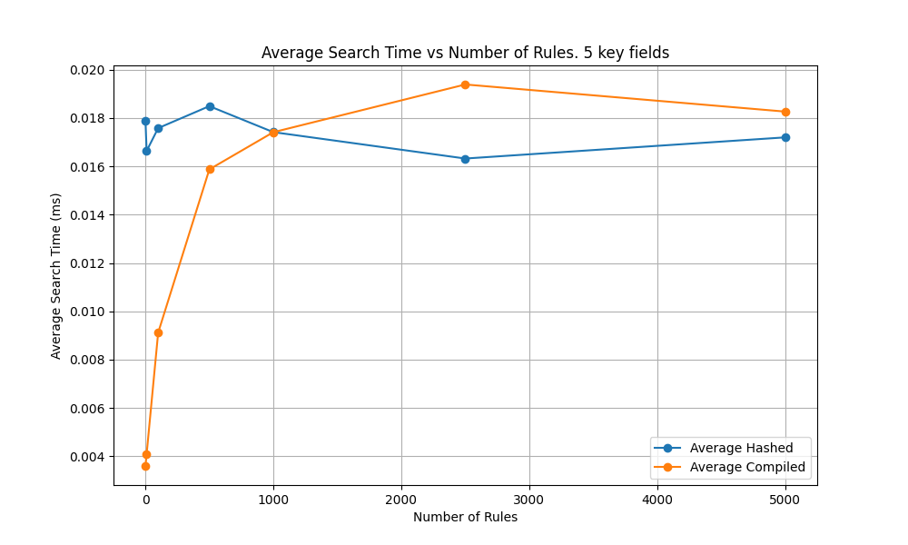
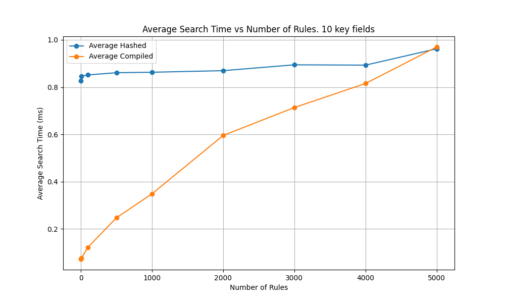
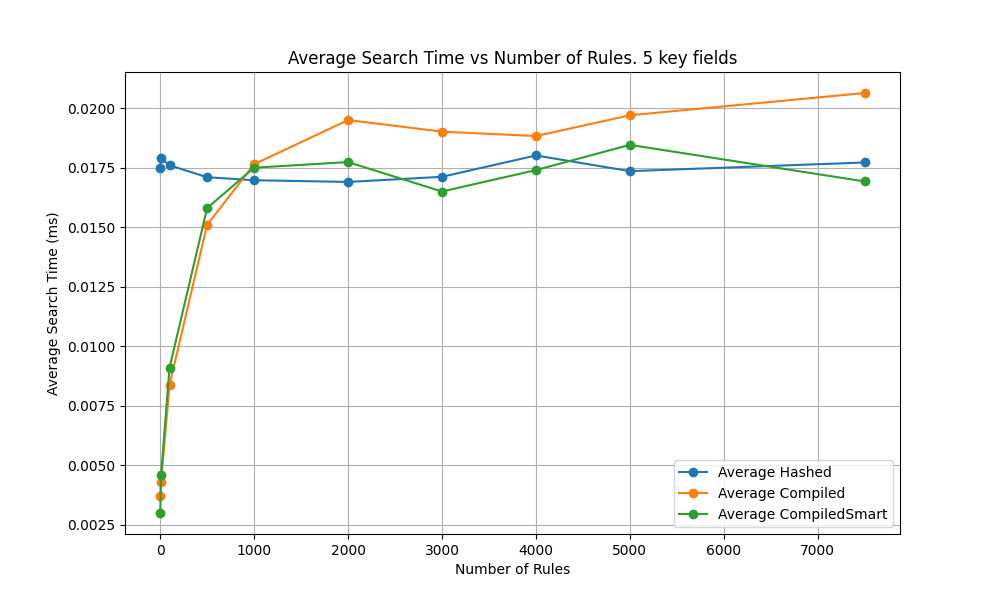

# multidimensional-cache
## Overview

In many software applications, data retrieval using a dictionary of keys often involves hierarchical rules. The search prioritizes matching the most specific criteria before considering less specific ones. This scenario is common in rule-based systems where fallback to wildcarded fields is necessary.

For instance, consider a cache for fruits based on color, acidity, and size. You might define rules such as:
- Rule 1: Fruits that are yellow, below 1kg, and acidic (three fields pattern)
- Rule 2: Fruits that are yellow and acidic (two fields pattern)
- Rule 3: Fruits that are acidic (one field pattern)
- Rule 4: Fruits that are green (one field pattern)
- Rule 5: Fruits that are red (one field pattern)

Using these rules:
- A lemon would match Rule 1, 2, and 3, but Rule 1 is applied as it matches the most fields.
- A banana might only satisfy Rule 3.
- An avocado may not match any rules.

A search in a three-dimensional cache would proceed like an if-then-else tree, where the deeper the tree, the fewer fields are checked:

```python
if cache_search(fruit.colour=X, fruit.acidity=Y, fruit.size=Z) ...
elif cache_search(fruit.colour=X, fruit.acidity=Y) ...
elif cache_search(fruit.acidity=Y, fruit.size=Z) ...
elif cache_search(fruit.colour=X, fruit.size=Z) ...
elif cache_search(fruit.colour=X) ...
elif cache_search(fruit.acidity=Y) ...
elif cache_search(fruit.size=Z) ...
else: not found
```


## Hashed Serialized Caches

A generic and performant implementation of this cache search uses hashing by serializing a multidimensional key, where a wildcard represents unspecified keys. Each `cache_search` is indexed, achieving O(1) complexity. However, the number of field combinations grows exponentially, calculated as 2n−12^n - 12n−1, where nnn is the number of fields.

For example:
- 3 fields yield 7 combinations.
- 5 fields yield 31 combinations.
- 10 fields yield 1023 combinations.

Checking each combination can slow down the search, resulting in a complexity of (2n−1)∗O(1)(2^n - 1) * O(1)(2n−1)∗O(1). For instance:
- A lemon would match at the first check.
- A banana might explore 5 combinations.
- An avocado might check all 9 combinations before being resolved as a no hit.
## Data Introspection

For slowly changing rules, leveraging data introspection can dynamically optimize the search process. This involves pre-determining which combinations will never yield a match, thereby excluding unnecessary checks. This process is known as compilation.

Using the previous example:
- Rule 1: color, acidity, size
- Rule 2: color and acidity
- Rule 3: acidity
- Rule 4: color
- Rule 5: color

We can exclude some cases from our checks:

```python
if TRUE and cache_search(fruit.colour=X, fruit.acidity=Y, fruit.size=Z) ...
elif TRUE and cache_search(fruit.colour=X, fruit.acidity=Y) ...
elif FALSE and cache_search(fruit.acidity=Y, fruit.size=Z) ...
elif FALSE and cache_search(fruit.colour=X, fruit.size=Z) ...
elif TRUE and cache_search(fruit.colour=X) ...
elif FALSE and cache_search(fruit.acidity=Y) ...
elif FALSE and cache_search(fruit.size=Z) ...
else: not found
```


By doing so, we reduce the number of checks from 9 to 3.

The cost of this optimization is in the initial compilation process, which determines which branches to evaluate. This high-cost operation depends on the data, making it suitable for static rules but dynamic events.
## The Code

The Python implementation includes two cache types: 
- `HashedCache`: A pure hash-driven approach. 
- `HashedCacheCompiled`: A hash-based cache with compiled search optimization.

`HashedCacheCompiled` includes a method to compile the `matching_pattern` dictionary, which indicates which combinations to skip:

```python
from itertools import combinations

class HashedCacheCompiled:
	...

    def _compile_patterns(self, param_keys):
        """
        Check all possible combinations of the provided parameter keys to see if they
        match any rule in the cache. Cache the results.

        Parameters:
        param_keys (list): A list of parameter keys to check.
        """
        # Iterate over all lengths of combinations from the length of param_keys down to 1
        for i in range(len(param_keys), 0, -1):
            # Generate all combinations of param_keys of length i
            for combo in combinations(param_keys, i):
                # Check if the current combination matches any data in the cache
                has_matching_pattern = self.has_matching_data(combo)
                # Cache the result of whether this combination has matching data
                self.matching_pattern[combo] = has_matching_pattern

    def generate_keys(self, params):
        """
        Generate all possible keys with decreasing number of parameters.
        """
        keys = []
        param_keys = list(params.keys())
        for i in range(len(param_keys), 0, -1):
            for combo in combinations(param_keys, i):
				# skip patterns that do not match any rule
                if self.matching_pattern[combo]:
                    key = tuple((k, params[k]) for k in combo)
                    keys.append(key)
        return keys
```

## Results

As expected, the number of rules defined impacts the efficiency of pattern exclusion. For a 5-field index:
- With 1000 rules, it's likely that all 31 combinations are covered, providing no optimization advantage.
- With 100 rules, approximately half of the combinations might be covered, resulting in a 50% improvement in performance.
- With fewer than 100 rules, performance improvements are even more significant.

This approach optimizes search performance by reducing the number of necessary checks, particularly beneficial in scenarios with static rules but dynamic data events.
### Graphs
#### 5 Fields Cache Comparison



#### 10 Fields Cache Comparison




The graphs reveal several insights:
- With an increasing number of rules, there's a point at which all pattern combinations potentially yield a result. Beyond this point, the overhead of checking if the pattern is valid makes the compiled search slightly slower than the pure hashed one.
- Transitioning from 5 key fields to 10, the latency increases exponentially from 20ms to about 800ms due to the increased patterns search (from 31 combinations to 1023).
## Further Optimizations
### AshedCacheCompiledSmart

To address situations where all patterns may yield a match, a smart approach detects this and switches back to the simpler hashed implementation. This is implemented in the `AshedCacheCompiledSmart` class:

```python
class AshedCacheCompiledSmart(AshedCacheCompiled):

    def compile_patterns(self):
        # calculate as usual the patterns
        super().compile_patterns()

        # If all patterns are valid, fall back to the AshedCache class
        if all(self.matching_pattern.values()):
            self.__class__ = AshedCache
```


The new implementation combines improvements of the `AshedCacheCompiled` below the threshold of full tree search with the flat line of `AshedCache` above that:



## Conclusions

The multidimensional cache implementation discussed in this project offers a robust solution for efficiently handling complex hierarchical data structures. Through a series of experiments and optimizations, several key conclusions emerge: 
- **Rule-Based Optimization** : The cache's performance is intricately tied to the number and specificity of rules defined. By carefully defining rules to cover common patterns and utilizing wildcard matching where applicable, significant performance improvements can be achieved. 
- **Dynamic Data Events** : While the cache's rules may remain static, the data events driving cache lookups are dynamic. This necessitates an approach that balances efficient rule matching with the flexibility to adapt to changing data patterns. 
- **Compiled Pattern Detection** : The introduction of compiled pattern detection in the `AshedCacheCompiledSmart` class offers an elegant solution to dynamically switching between optimized and traditional search approaches. By intelligently detecting scenarios where all patterns may yield a match, unnecessary overhead is avoided, leading to improved overall performance. 

In conclusion, the multidimensional cache implementation presented here demonstrates the importance of thoughtful rule definition, dynamic adaptation to changing data patterns, and innovative optimization techniques. By leveraging these principles, developers can create efficient and scalable caching solutions tailored to their specific use cases.


